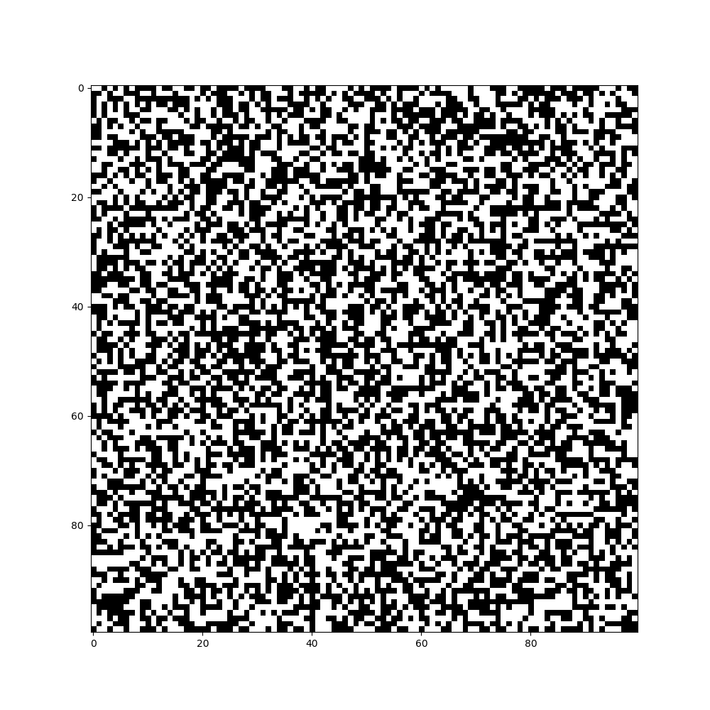

# Cellular Automata

We present you a new Python library , the **cellular_automata**.

## How to install

Clone the current repository and then,

```bash
> cd cellular_automata_library
> python3 setup.py install
```

That's it you already you have install it.

## What can I do?

Let's start with a simple and famous example - cellular automata,
the [game of life](https://en.wikipedia.org/wiki/Conway%27s_Game_of_Life).
  Show go to favorite Python IDE or directly to Python repl and copy the follow piece of code,

```python
from cellular_automata.cellular_automata import CellularAutomata as ca
game_of_life = ca(width=100,height=100,generations=100)
game_of_life.game_of_life()
```

At the end , a GIF will be pop up to our desktop , like this,

 


## Preview all choices

First of all until now the library support only binary cellular automata,
 with the below formatting
 * [Moore neighbohood](https://en.wikipedia.org/wiki/Moore_neighborhood),
 In this case the cell has 8 neighbors and the formatting of rule is,
 Bxxx/Sxxx. The x can be numbers fro 0 to 8.
 * [Von Neumann neighborhood
](https://en.wikipedia.org/wiki/Von_Neumann_neighborhood),
 In this case the cell has 4 neighbors and the formatting of rule is,
 Bxxx/SxxxV. The x can be numbers fro 0 to 4.
 * [Hexagonal neighborhood](https://en.wikibooks.org/wiki/Cellular_Automata/Neighborhood)
 In this case the cell has 6 neighbors and the formatting of rule is,
  Bxxx/SxxxH. The x can be numbers fro 0 to 6.
 * Now library support and this rule notation Bxxx/Sxxx/C(H, V).Where the C is the number of states
 So, If we want to implement the [Star Wars rule](http://www.mirekw.com/ca/rule_starwars.html), will
 parse this, B2/S345/4


```python
ca(width=10,height=10, input_array='', generations=10, save_image=False,save_movie=False
                 save_data=False, filename='')
```
These are the pre-define parameters of our library

* width: is take an int number and define the width of our board
* height: is take an int number and define the height of our board
* input_array: is take a numpy array,with only 0's and 1's. If we don't
define this parameter the library will create a random numpy array with zeros and ones
* generations: is take a int number and define how many generations we will have
* save_image:If is True library save the output as gif with the name which define the parameter filename
* save_file: If is true create a file with the name of parameter filename and it contains a list of numpy arrays
*save_movie: If is True library save the output mp4 move with the name which define the parameter filename
* filename: This name is used to save the gif file and the list of numpy array,which represnt the generations

Even if you don't choose to save your data at the begin you can call , anytime , the method `store_data`

A list of cellular rules which already are implemented and how we call them,

First define the above parameters

```python
from cellular_automata.cellular_automata import CellularAutomata as ca
sample = ca(width=10,height=10, input_array='', generations=10, save_image=False,
                          save_data=False, filename='')
```

1. Game of life
```python
sample.game_of_life()
```
2. Replicator
```python
sample.replicator()
```
3. Seeds
```python
sample.seeds()
```
4. Life without death
```python
sample.life_without_death()
```
5.Life
```python
sample.life()
```
6.Diamoeba
```python
sample.diamoeba()
```
7.2x2
```python
sample.rule_2x2()
```
8.HighLife
```python
sample.highlife()
```
9.Day & night
```python
sample.day_and_night()
```
10.Morley
```python
sample.morley()
```
11. Anneal
```python
sample.anneal()
```

But someone want to implement his rule or the rule we don't have implement yet.So? No problem.

```python
sample.specify_rule_2d(<rule>)
```
The only restriction is that the rule must be in this formation, Bxxx/Sxxx. Where x is number from 0 to 8.
For example if you to specify the Anneal rule, you can just do this,
```python
sample.specify_rule_2d('B4678/S35678')
```
There rest will be done from our library.


## TODO
- [ ] Add classic [examples of patterns](https://en.wikipedia.org/wiki/Conway%27s_Game_of_Life)
- [ ] Add Wolfram 256 rules
- [ ] Add library to pip
- [ ] Improve the speed of library
- [ ] Add more binary cellular automata
- [ ] Add binary stochastic cellular automata
- [ ] Add automata with more than 2 states
- [ ] Add more complecate automata-models like [Forest-fire model](https://en.wikipedia.org/wiki/Forest-fire_model)
- [ ] Make easier to users to make their models like that